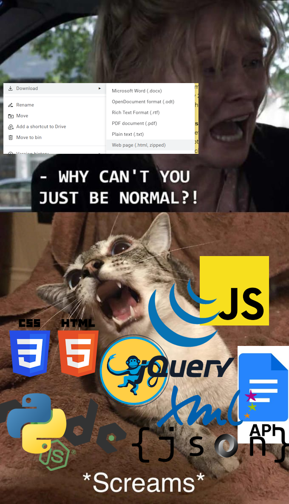

# psiNotes-DocYoinker

### The "master plan pipeline"
- [x] ~~Put the GDoc Document object's JSON in a `.json`.~~ 
- [ ] Option to check what docs are downloaded to not waste bandwith. (and also compare revisionId to see if there were any changes.)
- [ ] Save doc metadata somewhere.
- [ ] Make a stash of functions to handle different parts of it.
- [x] ~~First, the hard part - search for all images and their positions (so, `PositionedObject`'s).~~ "hard part" lol
- [ ] Download all of the images to `../yoinkstash/pos_objs/` and put their ID's into `../yoinkstash/pos_objs/rawposobjs.json`
- [ ] Then grab all the text and tables.
- - [ ] Find and put tables in a `../yoinkstash/tables/tables.json`
- [ ] The rest goes to `../yoinkstash/text/rawtext.json`
- - [ ] Develop some system to identify your headers and etc (initially only for Notebook Zero).
- - [ ] Implement an separate general header segmenting system for non-Notebook-Zero notebooks.
- - - [ ] Split `rawtext.json` into `segtext.json` (segmented text). 09/11/24 NOTE: maybe that's stupid.
- [ ] Make the app into a CLI to control what it is supposed to do any given time.
- **<❗>** Everything stores its position!
- [ ] The first hellish attempt at trying to convert everything to XML ~~or even HTML~~...
- - **<❗>** ....but maybe converting the JSON data into a very decent XML format i can engineer is a better idea?
### 1-image project explanation

